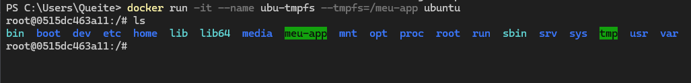
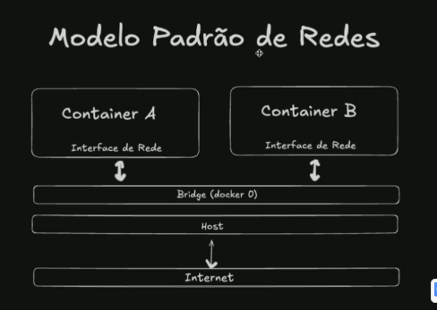
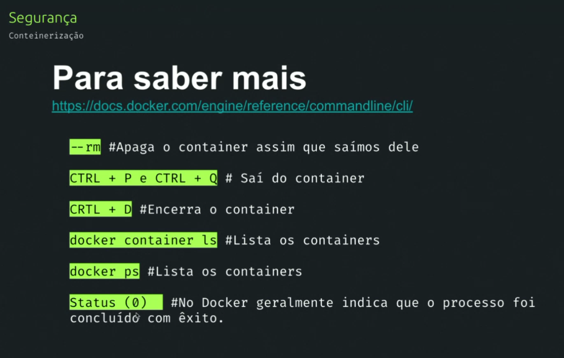
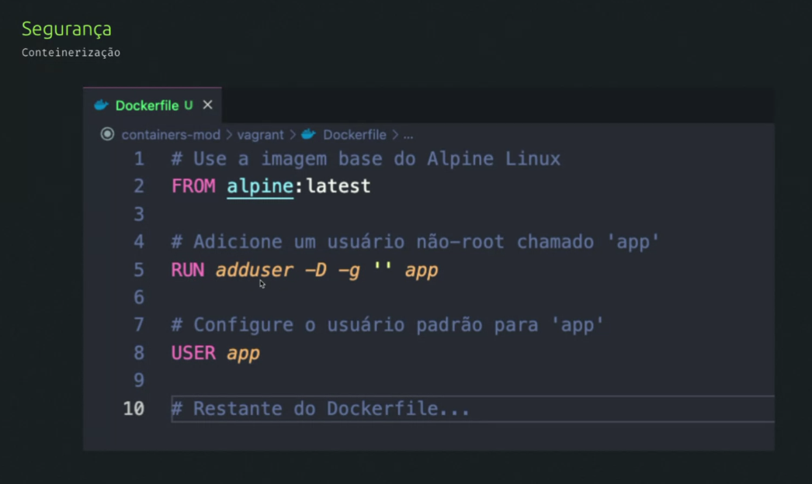

# Volumes

`docker volume create` 
`docker volume create --name <nome-do-volume>` 
`docker volume ls`

## Arquivo tmpfs - temporário

`docker run -it --name ubu-tmpfs --tmpfs=/nome-diretorio ubuntu` 
ou 
`docker run -it --name container-mount --mount type=tmpfs,destination=/meu-app ubuntu`

*Obs: meu-app e tmp estão na mesma cor.*

`docker start -ai ubu-tmpfs` 
* -ai = attach iterative

Ao encerrar o container e reiniciar, **os arquivos são perdidos**.

## Camadas read e write

`docker run -it --name container-rw ubuntu`

Ao encerrar o container e reiniciar, **os arquivos permanecem**.

# Imagem

docker buildx build -t <nome-imagem> .

docker image inspect <nome-imagem>

# Container

`docker run --rm <nome-imagem> bash -c 'echo $<S3_BUCKET-nome-env>'`
  * --rm remove o container, após rodar

`docker rm <nome-container>`

`docker image inspect --format='{{index .Config.Labels \"<nome-lable>\"}}' <nome-imagem>`

`docker run -dit --name container2 ubuntu`

`docker exec -it <nome-container> bash`

`docker run -dit --network host --name <nome-container> ubuntu`

`docker run --rm --net none alpine ash -c "ifconfig"`

`docker run --rm --net host alpine ash -c "ip -4 addr show | grep inet | grep -v 127.0.0.1 | awk '{print \$2}' | cut -d/ -f1"`

LINUX:
docker inspect container1 | grep "IPAddress"

WINDOWS:
docker inspect container1 | findstr "IPAddress"

 *saida:

  ` "SecondaryIPAddresses": null,
    "IPAddress": "172.17.0.2",
    "IPAddress": "172.17.0.2",`

Dentro do container:
* apt update && apt install dnsutils -y
* apt-get install -y iputils-ping

# Redes Docker:

 docker network ls

| NETWORK ID   |  NAME  |    DRIVER  |  SCOPE |
|------------- |--------|------------|--------|
|2a22e8dad622 |  bridge  |  bridge  |  local  |
|fee28e2ce443 |   host   |   host   |   local |
|9f589e5e4d2b |  none    |  null    |  local  |

## Redes padrão:

### Bridge

Modelo padrão ao criar container é Bridge:

 

 Container na rede bridge conseguem trocar informações entre si.

### Host

Mais veloz porque está na mesma rede da máquina onde está sendo rodado o container.

### None

Container isolado.

É possível nomear as redes, por padrão elas recebem o tipo bridge.

### Comandos rede

`docker network inspect <nome-rede>`

`docker network create <nome-rede>`

`docker network connect <nome-rede> <nome-container>`

[Format command and log output](https://docs.docker.com/engine/cli/formatting/)

# Comandos

`docker system prune -a`

# Segurança:

1. Evitar expor o usuário root
2.