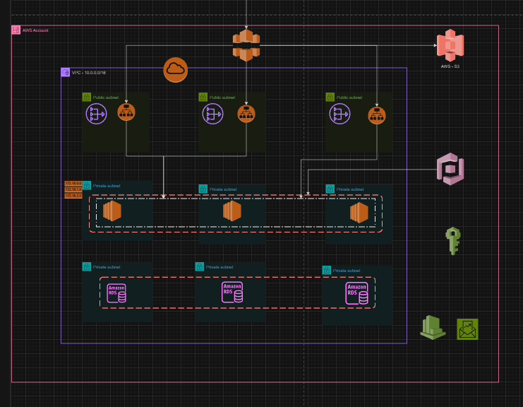

# Arquitetura

Este projeto cria uma infraestrutura AWS usando o Terraform.

## Cloud Front
Exitem duas distribuições do cloudfront, uma com origin configurado para o S3 e outra para o load balancer da aplicação.

## Comandos básicos terraform
aws sts get-caller-identity 
terraform --help 
terraform init 
terraform fmt -check -diff -recursive 
terraform validate 
terraform plan 
terraform plan -out=plano.saida 
terraform show plano.saida 
terraform apply 
terraform destroy 

## Links de alguns recursos da documentação utilizados

https://registry.terraform.io/providers/hashicorp/aws/latest/docs

https://developer.hashicorp.com/terraform/language/values/outputs

https://registry.terraform.io/providers/hashicorp/aws/latest/docs/resources/rds_cluster

https://registry.terraform.io/providers/hashicorp/aws/latest/docs/resources/s3_bucket_policy
